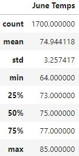
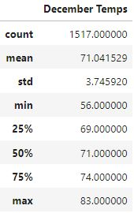

# Surfs_Up
An Analysis of the temperature data for select months in Oahu to determine business viability

## Deliverable 1 - June Temperature Data

## Deliverable 2 - December Temperature Data
 

## Deliverable 3 - Summery Analysis
* The Average temperature only veries between the two months by about 3 or 4 degrees.  
* The Maximum temperature veries even less between the two months, showing that they can both get quite hot.
* The most veried data comes from the minimum temperature, where in December the temperature can get as low as 56, where June only ever got as low as 64. 

Judging by this data, I'd say that it would definitely be viable to keep the surf shop open during both months, as the average temperatures don't vary by much, and beach goers would likely remain steady. The cream sales on the other hand are a bit riskier to run in December. When it gets that cold, people probably wont want a cold treat. 

Two more queries you could run for more data would be to try and find the average temperature during peak business hours as well as to find the average sunniness of each month. The first would better reflect the effect of temperatures on viable sales, rather than temperatures during closed hours for example. And the second would help determine riskier months in terms of rain limiting business.
